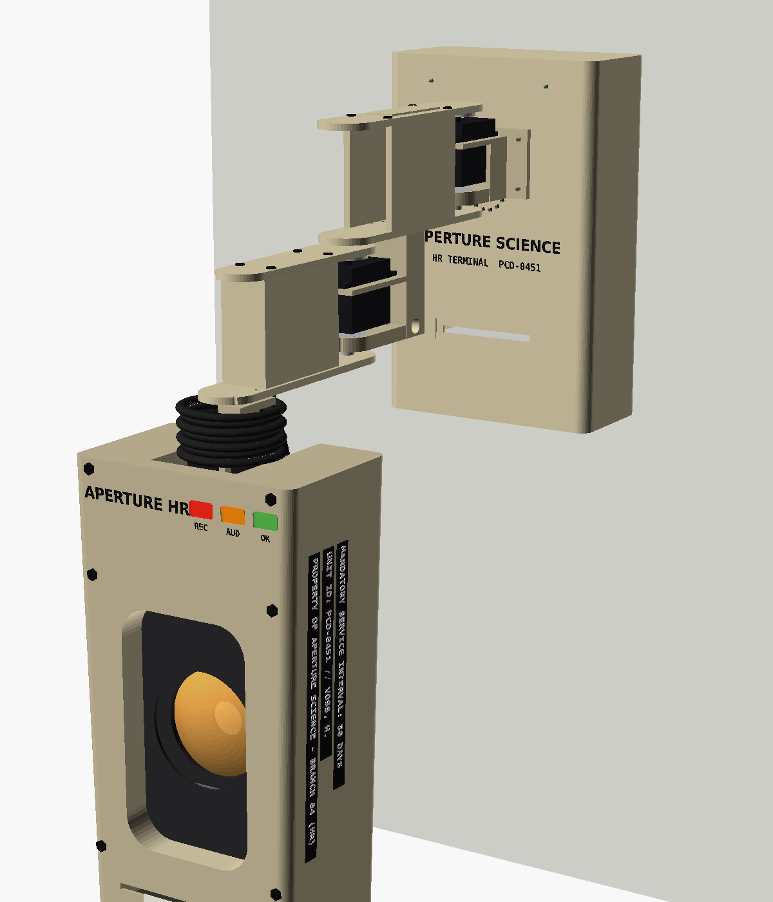
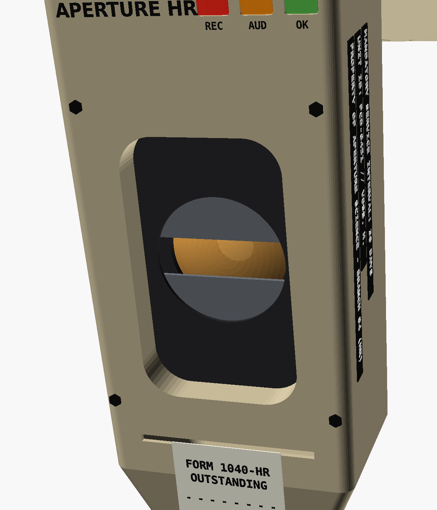

# M.E.M.O. — PCD-0451

**Mandatory Employee Monitoring & Oversight.** A wall-mounted, Claude-powered home
assistant with a folding two-link arm and a tall, late-'70s Aperture Science
HR-terminal head. She hears a wake word, turns toward you, answers out loud through an
intercom filter, squints her mechanical eyelids at infractions, and prints memos.

> Personal, non-commercial fan build. Aperture Science and Portal belong to Valve.
> M.E.M.O. and Dr. Harriet Voss are original fan characters.

| | |
|---|---|
|  |  |
| Home pose on the wall | Audit mode: shutters squint the amber eye |

## Status (v0.3)

| Area | State |
|---|---|
| Software | Complete pipeline; 20 offline tests pass; **not yet run on hardware** |
| CAD | Full parametric OpenSCAD model; every part exported; joint sweeps collision-checked (all clear) |
| Hardware | Not built. Servo, printer and speaker dimensions are datasheet values to verify with calipers |

## What's in the repo

```
memo/            Python package (runs on the Pi as systemd service "memo")
tests/           Offline tests: MEMO_SIM=1 python -m unittest discover tests
deploy/          install.sh, systemd unit, config.txt lines, env template
cad/             OpenSCAD model, part export, renders, collision checker
  memo.scad        all parts, parametric
  assembly.scad    posed assembly (-D SH= EL= TILT= SHUT=)
  view_eye.scad    eye-mechanism close-up
  tools/           parts.scad, export.sh, render.sh, collide.py
  stl/             every part, ready to slice
docs/            Build documentation (start below)
```

## Documentation

1. [Overview and character](docs/01-overview.md): who she is, how she behaves, moods
2. [Hardware](docs/02-hardware.md): bill of materials, wiring, power
3. [Mechanical design](docs/03-mechanical.md): frame, joint stack, head, eye mechanism, limits, known risks
4. [Printing](docs/04-printing.md): part list, sizes, materials, orientation, fasteners
5. [Assembly](docs/05-assembly.md): build order
6. [Software](docs/06-software.md): pipeline, modules, tools, configuration
7. [Bring-up and calibration](docs/07-bringup.md): install, first power-on, tuning, troubleshooting
8. [CAD workflow](docs/08-cad-workflow.md): editing, exporting, rendering, collision checks

## Quick start (desktop, no hardware)

```bash
pip install -r requirements.txt
MEMO_SIM=1 python -m unittest discover tests
MEMO_SIM=1 MEMO_DATA=/tmp/memo ANTHROPIC_API_KEY=sk-ant-... python -m memo.main --text
```

## Key numbers

| | |
|---|---|
| Budget | ~$150 target in parts (see the BOM for the honest total); Claude API billed separately |
| Housing | 144 W × 70 D × 226 H mm, keyhole back plate on one stud |
| Arm | L1 120 + L2 100 mm, horizontal-plane joints (servos never fight gravity) |
| Head | ~300 × 140 × 90 mm, hangs from a tilt axis near its top, ~600 g |
| Reach | head front ~390 mm from the wall when straight out |
| Servos | MG996R shoulder + elbow, DS3218 tilt, SG90 eye shutters, PCA9685 |
| Brain | Pi Zero 2 W, local wake word + STT, Claude Haiku 4.5, Piper TTS |

See [CHANGELOG.md](CHANGELOG.md) for what changed from v0.2.
