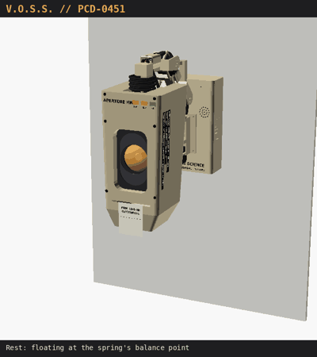

# V.O.S.S. — PCD-0451

**Virtual Oversight & Supervision System.** A wall-mounted, Claude-powered home assistant
on a spring-balanced robot arm, with a deep, late-'70s HR-terminal head:
- **Moves:** the arm swivels, lifts and leans, like a desk lamp.
- **Eye:** an amber eye slides up and down a slot behind mechanical eyelids.
- **Sound:** she answers out loud through an intercom filter.
- **Paper:** she prints memos.

> Personal, non-commercial fan build in the style of Valve's Portal. Aperture Science
> belongs to Valve; V.O.S.S. and Dr. Harriet Voss are original fan characters. The
> department seal is an original design, not the Aperture logo.

| | | |
|---|---|---|
|  |  |  |
| Home pose on the wall | Arm and deep head, side view | Audit mode: eye low, lids squinted |



*A 17 s routine rendered from the CAD with the firmware's own poses, easing and idle sway (MP4: `docs/img/voss_routine.mp4`).*

## Status (v0.5)

| Area | State |
|---|---|
| Software | Complete pipeline; 23 offline tests pass; **not yet run on hardware** |
| CAD | Full parametric OpenSCAD model. Every part is exported, and every joint plus the moving eye is collision-checked (all clear) |
| Hardware | Not built. Servo, printer and speaker dimensions are datasheet values to verify |

## What's in the repo

```
voss/            Python package (runs on the Pi as systemd service "voss")
tests/           Offline tests: VOSS_SIM=1 python -m unittest discover tests
deploy/          install.sh, systemd unit, config.txt lines, env template
cad/             OpenSCAD model, part export, renders, collision + load checks
  voss.scad        all parts, parametric
  assembly.scad    posed assembly (-D YAW= SH= EL= PITCH= EYE= SHUT=)
  view_eye.scad    eye carriage close-up
  tools/           parts.scad, export.sh, render.sh, collide.py, loads.py, head_mass.py, reach.py
  stl/             every part, ready to slice
docs/            Build documentation
```

## Documentation

0. [Personnel asset record (bio)](docs/00-bio.md)
1. [Overview and character](docs/01-overview.md)
2. [Hardware: BOM, wiring, power](docs/02-hardware.md)
3. [Mechanical design](docs/03-mechanical.md)
4. [Printing](docs/04-printing.md)
5. [Assembly](docs/05-assembly.md)
6. [Software](docs/06-software.md)
7. [Bring-up and calibration](docs/07-bringup.md)
8. [CAD workflow and gallery](docs/08-cad-workflow.md)

## Quick start (desktop, no hardware)

```bash
pip install -r requirements.txt
VOSS_SIM=1 python -m unittest discover tests
VOSS_SIM=1 VOSS_DATA=/tmp/voss ANTHROPIC_API_KEY=sk-ant-... python -m voss.main --text
```

## Key numbers

| | |
|---|---|
| Budget | ~$220–235 at list prices, ~$190–200 with SD card, wire and filament on hand; Claude API billed separately |
| Arm | Yaw + shoulder + elbow + head tilt; L1 120, L2 100 mm; spring-balanced shoulder |
| Head | ~300 tall × 151 deep (crown) × 140 wide, ~690 g, kept level automatically; tilt −40…+50° |
| Eye | 60 mm amber lens on a carriage, ±24 mm travel in the slot, rack-and-pinion eyelids |
| Reach | head front up to ~430 mm off the wall, ~±255 mm side to side, ~315 mm up/down |
| Servos | MG996R yaw, 2× DS3225 shoulder + elbow, DS3218 tilt, 2× SG90 (eyelids, eye lift) |
| Brain | Pi Zero 2 W, local wake word + STT, Claude Haiku 4.5, Piper TTS |

See [CHANGELOG.md](CHANGELOG.md) for the history (M.E.M.O. v0.2 → V.O.S.S. v0.5).
