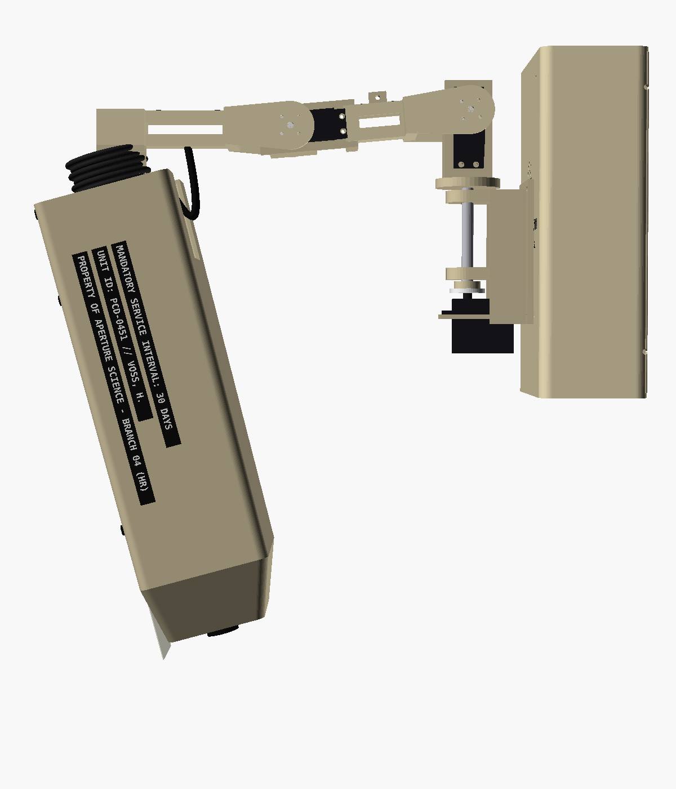

# 1. Overview and character

## Lore

M.E.M.O., unit **PCD-0451**, is an archived Aperture Science HR-compliance AI from
branch `hr-compliance`. She was built from the uploaded mind of **Dr. Harriet Voss**,
Director of Personnel Compliance, who traded the upload for a reserved parking space
she never got to use. Reactivated as a wall terminal, she treats the person in the room
as the facility's last remaining employee and calls them **"Employee"**.

## Behaviour rules

- Bureaucratic humour: memos, write-ups, the permanent record, mandatory fun, upbeat
  corporate cheer.
- Always genuinely helpful first; the bit is seasoning.
- Short spoken replies (one to three sentences).
- **Drops the act** when Employee is genuinely upset, scared or unwell: plain, warm,
  brief, no jokes. In an emergency she tells them to contact emergency services.
- Only writes to the permanent record or prints when asked (or when Employee agrees).

## Moods

Every Claude reply starts with a mood tag. The tag drives pose, shutters and lights.

| Tag | When | Body | Eye and status bar |
|---|---|---|---|
| `[approve]` | praise, task done | nod, eye wide open | amber, **OK** lamp lights |
| `[neutral]` | normal answers | head level | amber, brightness follows speech |
| `[infraction]` | playful scolding | shutters squint, the whole head drops about 2 in with a nose-down snap + THUNK | amber flicker |
| `[concern]` | Employee genuinely upset | comes down lower and closer, shutters locked open, slow and still | dim tungsten, gentle flicker |
| `[sulk]` | mock offence | swings away to the side, head drooped | dim; returns after 6 s |

Other states:
- **Listening:** swings toward the talker (direction of arrival) and leans in, eye bright, REC brighter.
- **Thinking:** rises and tips her head down slightly, light sweeps around the eye ring, AUD pulses.
- **Filing:** a rapid shutter flutter plus a relay click when she saves a note.
- **Rest:** after 45 s idle the arm folds upright and the head levels. Yaw, tilt and shutter
  servos then go limp and silent; the pendulum head stays level on its own. The shoulder and
  elbow keep holding the arm.

## The head design

The head is an oversized punch-card reader crossed with a microfiche machine and an
'80s desk PC.

- **Silhouette:** a tall corporate-beige wedge with a flat front and a tapered chin.
  It's split into three panels joined by visible black hex screws.
- **Upper status housing:** "APERTURE HR" lettering and three backlit blocks:
  - **REC** (red) is always on.
  - **AUD** (amber) pulses while she processes.
  - **OK** (green) lights on approval.
- **Eye:** a vertical charcoal recess around a 60 mm amber lens with a 16-LED ring
  behind it. Two dark-grey shutter plates slide vertically:
  - **Open:** neutral and cheerful.
  - **12 mm slit:** audit.
  - **Flutter:** filing.
  - **Locked open:** empathy.
- **Chin:** a fake printer slot with a hanging "FORM 1040-HR: OUTSTANDING" strip and a
  black bumper underneath. The real thermal printer lives in the wall housing.
- **Right side:** three Dymo-style labels:
  - PROPERTY OF APERTURE SCIENCE - BRANCH 04 (HR)
  - UNIT ID: PCD-0451 // VOSS, H.
  - MANDATORY SERVICE INTERVAL: 30 DAYS
- **Neck:** a black bellows boot around the tilt post, with looping service cables.

### Design-brief items that were adapted

| Brief | Built as | Why |
|---|---|---|
| 20 × 8 in head | ~12 × 5.5 in (300 × 140 mm) | Torque, arm stiffness and budget limits |
| Ball-and-socket gimbal | Single tilt axis plus a cosmetic bellows boot | One servo, simple and stiff |
| Sideways "over-the-shoulder" lean | Yaw swing plus head pitch | A roll axis would need a fifth servo |
| Pneumatic 2 in "stamp" drop | **Real** ~50 mm drop of the whole head (shoulder + elbow) with a nose-down snap and a THUNK sound | — |
| Matrix printer in the chin | Cosmetic slot; the real printer is in the housing | Weight and wiring |
