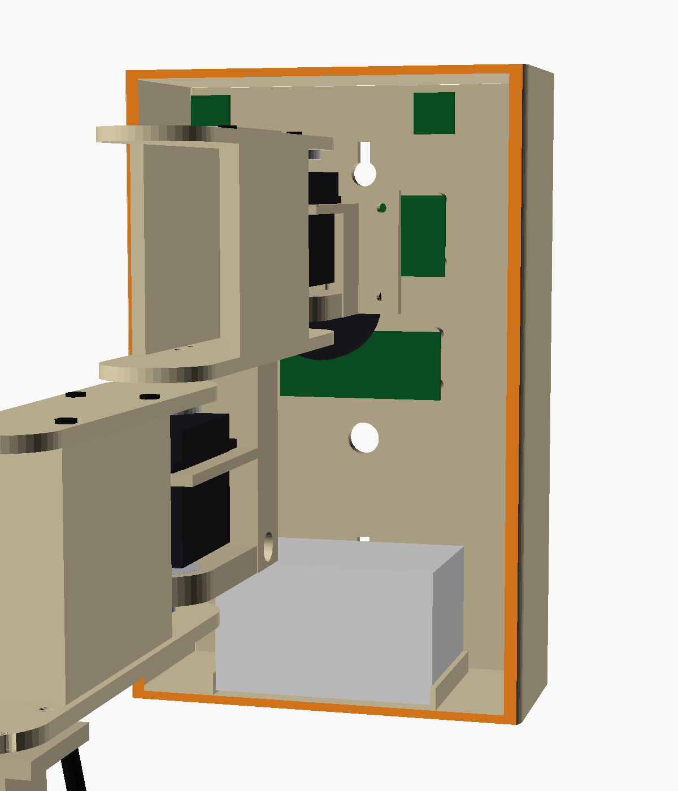

# 3. Mechanical design

All dimensions in mm. The model is `cad/memo.scad`; every number below is a named
parameter at the top of that file.

## Frame

X along the wall, Y out of the wall, Z up. Wall face is y = 0. The shoulder axis is at
**(0, 108, 0)**. The firmware uses the same frame (`memo/config.py`).


## Joints

| Joint | Axis | Servo | Range (checked) | Zero |
|---|---|---|---|---|
| Shoulder | vertical, (0, 108) | MG996R | 5–175° | 90 = link1 straight out |
| Elbow | vertical, end of link1 | MG996R | −50…+125° | 0 = links in line |
| Tilt | horizontal (link2 Y), 14 mm past link2's end, z −184 | DS3218 | −35…+40° (+ = nose down) | head level |
| Shutters | rack and pinion | SG90 | aperture 0–1 (about 172° of servo) | 1 = open |

The shoulder and elbow move only in the horizontal plane, so those servos never hold
the arm up against gravity. The head hangs below its tilt axis like a pendulum. When
the servos go limp at rest, it settles level on its own.

## Vertical stack

Each joint is a **fork**: the top plate sits on the servo horn and the bottom plate
rides a coaxial M8 pin in a 608 bearing. The servo and its bracket sit between the
plates. Brackets enter only from the back sector the link never sweeps. The fork webs
start ≥ 28 mm from the axis.

| z (mm) | Shoulder (world) | | z (mm) | Elbow (link1 frame) |
|---|---|---|---|---|
| 7…11 | link1 top plate | | −62…−58 | link2 top plate |
| 4…7 | MG996R horn | | −65…−62 | MG996R horn |
| −37…0 | MG996R body (top face z 0) | | −106…−69 | MG996R body |
| −13.5…−10.5 | bracket shelf (flange screws) | | −82.5…−79.5 | hanger shelf |
| −48…−40 | bracket floor + 608 | | −116…−108 | hanger floor + 608 |
| −56…−52 | link1 bottom plate + M8 pin | | −124…−120 | link2 bottom plate + M8 pin |

Link2 passes **under** link1: there's a 2 mm gap between link1's bottom plate at −56
and link2's top plate at −58.

## Tilt joint

- **Servo:** the DS3218 is mounted on the tilt post with its shaft along +Y and its body
  pointing up.
- **Head ears:**
  - The **+ ear** (y 27.25–30.75) bolts to the horn.
  - The **− ear** (y −31…−27.5) rides an M4 bolt through a 624 bearing in the post's pivot plate.
- **Post neck:** above the servo flange, the post narrows to clear the head crown at
  −35° nose-up.
- **Crown slot:** the post and servo enter the head through a slot in the crown and
  upper back. A TPU bellows boot hides the slot.

## Head


- **Envelope:** 300 tall (z +30 to −270 relative to the tilt axis), 90 deep, 140 wide
  at the top, tapering to 128 at z −230. The chin then tapers to 66 × 92.
- **Shell:** 2.4 mm walls. It splits into three pieces at z −40 and z −195. Each upper
  piece has a 5 mm alignment skirt and four M3 bosses, plus visible hex screws on the
  front at each seam.
- **Eye cavity:** an 80 × 136 mm rounded recess, 15 mm deep, centred at z −116.
- **Status windows:** three 15 × 9 mm windows at z +12, with WS2812 boards behind them.
- **Chin slot:** 92 × 4 mm at z −210.

### Eye mechanism

| Shutters open | Shutters closed (audit slit) |
|---|---|
|  |  |

Layers from front to back (x in the head frame):

| x | Part |
|---|---|
| 45 | front face |
| 28–45 | charcoal recess |
| 26–28 | bezel, Ø66 opening |
| 23.6–25.6 | shutter plates (84 × 40) |
| 19.8–23.4 | racks + pinion (module 1, 18 T, r 9) |
| 16.4–19.6 | rack backing rails |
| 14–22 | Ø60 amber lens dome |
| 9–12 | 16-LED ring |
| 4–7 | rear plate |

How the shutters move:
- **Rack and pinion.** The pinion sits between two racks: the top plate's rack on the
  −Y side and the bottom plate's rack on the +Y side. Rotating the pinion moves the
  plates in opposite directions.
- **Travel.** Each plate travels 27 mm, which takes about 172° of SG90 rotation.
  Calibration defaults are `closed_deg 4`, `open_deg 176`.
- **Guides.** A grooved rail on the −Y side guides both plates' tongues.
- **Squint.** When closed, a 12 mm slit is left across the lens.

## Housing



- **Size:** 144 × 70 × 226 (z −190…36), open back.
- **Front features:**
  - mic holes 80 mm apart at z 20
  - 40 mm speaker grille at z −45
  - printer paper exit and tear-bar recess at z −137
  - lettering
  - four M3 holes plus a cable hole for the shoulder bracket
- **Bottom:** two DC jacks and vents.
- **Back plate:** two keyholes on the centreline (z 0 and −150) for one stud, standoffs
  for the Pi and PCA9685, and heat-set inserts in its edges.

## Collision check results

`cad/tools/collide.py` sweeps each joint through its full range in 5° steps (shutters
at 0, 0.5 and 1) and intersects the real part meshes. It also checks every pose the
firmware's workspace check accepts against the housing and the wall.

```
shoulder 5..175 : link1 vs housing/bracket   OK
elbow -50..125 : link2/head vs link1         OK
tilt -35..40 : head vs link2/post            OK
shutters 0..1 : plates vs head internals     OK
firmware workspace: 185 poses accepted, 31 rejected (grid 10 x 15 deg)
accepted poses : arm/head vs housing + wall  OK
```

Two caveats:
- The pinion-to-rack mesh is excluded, because the tooth profiles are approximate.
- Moving between two accepted poses isn't swept here. The firmware checks
  intermediate poses itself and reroutes through home when needed.

## Known risks

1. **Shoulder load.** The head is about 600 g. About 2.4 N·m of bending at the shoulder
   becomes roughly 38 N of side load shared by the MG996R spline and the 608 bearing.
   That's acceptable short-term but a wear risk. Two ways to reduce it:
   - Lighten the head: 1.6 mm walls and 15% infill bring it to about 400 g.
   - Add a 608 bearing cap above link1's top plate (there's room above z 11).
2. **Speed.** Firmware limits the shoulder to 90°/s and the elbow to 120°/s with eased
   moves, because of the head's inertia.
3. **Unverified dimensions.** MG996R, DS3218, SG90, printer module and speaker sizes are
   datasheet values. Measure yours and edit `MG`, `DS`, `SG` and the printer box first.
4. **Projection.** The head front sits about 390 mm off the wall when the arm is straight
   out. Mount it where nobody walks into it.
5. **Print bed.** The housing needs a bed of at least 230 mm in one axis (see
   [Printing](04-printing.md)).
