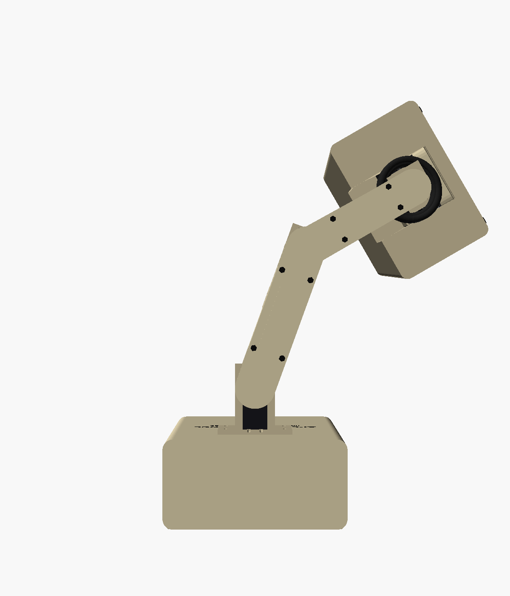
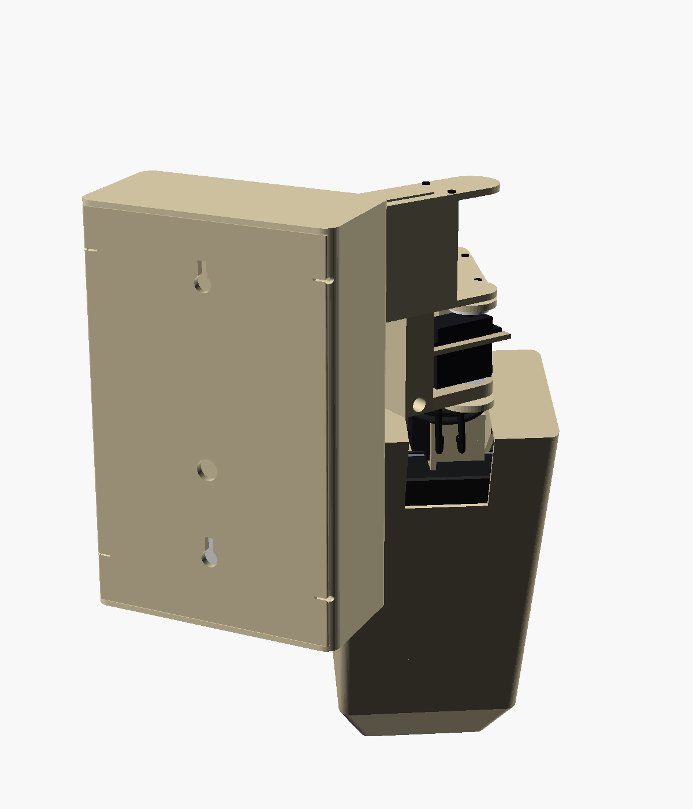

# 8. CAD workflow

Tools: OpenSCAD 2021.01+, plus `pip install trimesh manifold3d numpy` for the collision
checker. Rendering headless needs `xvfb-run`.

## Files

| File | Purpose |
|---|---|
| `cad/memo.scad` | Every part as a module in its own local frame; all parameters at the top |
| `cad/assembly.scad` | Posed assembly. `-D SH= EL= TILT= SHUT=` plus `SHOW_WALL`, `SHOW_HOUSING`, `SHOW_HEAD`, `SHOW_SHELL`, `CUTAWAY` |
| `cad/view_eye.scad` | Eye mechanism close-up |
| `cad/tools/parts.scad` | Exports one part: `-D 'PART="link1"'` |
| `cad/tools/export.sh` | Exports every part to `cad/stl/` (shutters at 0, 0.5 and 1) |
| `cad/tools/render.sh` | Renders every view in this documentation to `docs/img/` |
| `cad/tools/collide.py` | Joint sweeps and firmware-pose check (see [Mechanical](03-mechanical.md#collision-check-results)) |

## Frames and transforms

| Group | Frame | Transform from its parent |
|---|---|---|
| Housing, back plate, bracket, shoulder servo | world | — |
| link1, elbow hanger, elbow servo | link1 | `translate([0, SY, 0]) rotate([0, 0, SH])` |
| link2, tilt post, tilt servo | link2 | `translate([L1, 0, 0]) rotate([0, 0, EL])` |
| Head and everything inside it | head | `translate([L2 + TILT_OFF, 0, ZT]) rotate([0, TILT, 0])` |

`collide.py` uses the same transforms. If you change one, change both.

## Typical edit loop

```bash
cd cad
nano memo.scad                       # e.g. new servo dimensions
./tools/export.sh                    # ~1-2 min
python3 tools/collide.py             # must end with ALL CLEAR
./tools/render.sh                    # refresh docs/img
```

If you change arm or head geometry, update `memo/config.py` (`SHOULDER_XY`, `L1`, `L2`,
`HEAD_CENTER`, `HEAD_R`, `HOUSING_D`, `LIMITS`) so the firmware's workspace check still
matches.

## Gallery

| | | |
|---|---|---|
|  |  |  |
| Hero | Front | Side |
|  |  |  |
| Plan, looking at a talker | Audit squint | Stamp (nose down, shutters shut) |
|  |  |  |
| Sulk | Housing interior | Arm from behind |
