# 8. CAD workflow

Tools:
- OpenSCAD 2021.01 or newer
- `pip install trimesh manifold3d numpy` for the checkers
- `xvfb-run` for headless renders

## Files

| File | Purpose |
|---|---|
| `cad/voss.scad` | Every part as a module in its own local frame; all parameters at the top |
| `cad/assembly.scad` | Posed assembly: `-D YAW= SH= EL= PITCH= EYE= SHUT=` plus `SHOW_WALL`, `SHOW_HOUSING`, `SHOW_HEAD`, `SHOW_SHELL`, `CUTAWAY` |
| `cad/view_eye.scad` | Eye carriage close-up (`-D EYE= SHUT=`) |
| `cad/tools/parts.scad` | Exports one part: `-D 'PART="link1"'` (eye parts take `-D PE=` for height) |
| `cad/tools/export.sh` | Exports every part to `cad/stl/` (eye at −1/0/1, eyelids at 0/0.5/1) |
| `cad/tools/render.sh` | Renders every view in these docs to `docs/img/` |
| `cad/tools/collide.py` | Joint sweeps, moving-eye checks and the firmware-pose grid |
| `cad/tools/loads.py` | Static joint torques and the best counterbalance spring |
| `cad/tools/head_mass.py` | Head mass and centre of gravity (for choosing `HS`) |
| `cad/tools/reach.py` | Reach envelope over firmware-accepted poses |
| `cad/tools/animate.py`, `compose_anim.py` | Renders the expressive routine: the firmware `Body` runs on a virtual clock and every frame is a sample of its output. `python3 cad/tools/animate.py [N]` renders N more frames; then compose |

## Frames and transforms

| Group | Frame | Transform from its parent |
|---|---|---|
| Housing, back plate, yaw tower, yaw servo | world | — |
| Turret + spring mast, shoulder servo, yaw coupler | turret | `translate([0, SY, 0]) rotate([0, 0, YAW])` |
| link1 (incl. elbow bracket), cover, elbow servo | link1 | `rotate([0, -SH, 0])` |
| link2, cover, tilt post, tilt servo | link2 | `translate([L1, 0, 0]) rotate([0, -EL, 0])` |
| Head (tilt-axis frame) | head | `translate([L2 + TILT_OFF, 0, -TILT_DROP]) rotate([0, TILT, 0])` |
| Head shell and eye (shell frame) | shell | `head_frame()` = `translate([HS, 0, 0])` inside the head frame |

In `assembly.scad`, `HEAD_LEVEL=true` (the default) sets `TILT = SH + EL + PITCH`.
`collide.py` uses the same transforms; change both together.

## Typical edit loop

```bash
cd cad
nano voss.scad                       # e.g. new servo dimensions or a thinner head shell
./tools/export.sh                    # ~2-3 min
python3 tools/head_mass.py           # head CG x should be ~0; adjust HS if not
python3 tools/loads.py               # torques + spring rate
python3 tools/collide.py             # must end with ALL CLEAR
./tools/render.sh                    # refresh docs/img
```

If arm or head geometry changes, update `voss/config.py` (`YAW_XY`, `L1`, `L2`,
`TILT_OFF`, `TILT_DROP`, `HEAD_SECTIONS`, `OBSTACLES`, `LIMITS`) so the firmware's
workspace check still matches.

## Gallery

| | | |
|---|---|---|
|  | 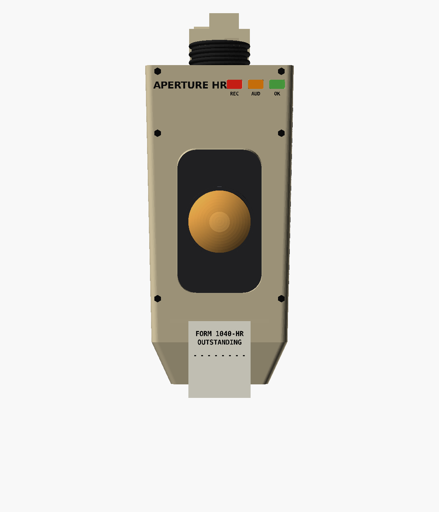 | 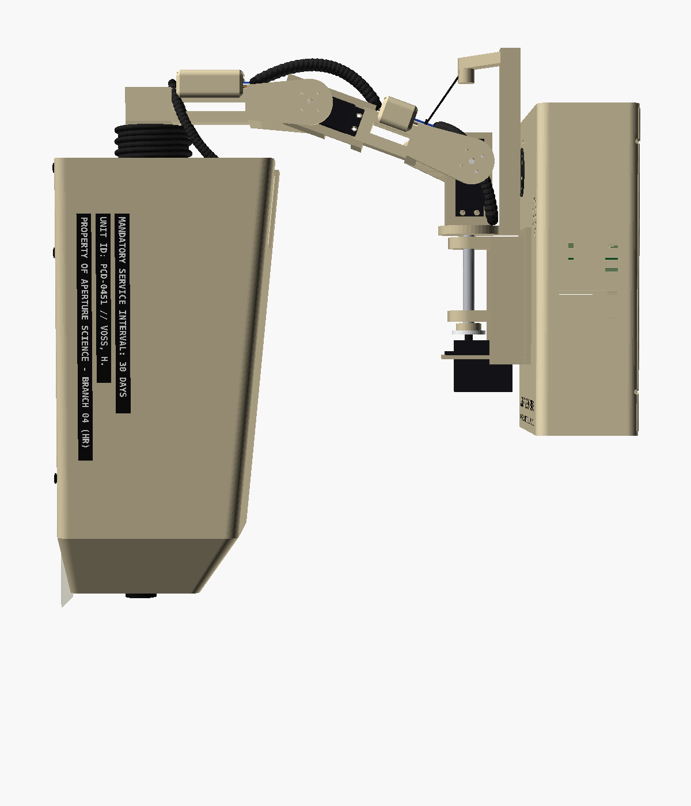 |
| Hero | Front | Side (home) |
| 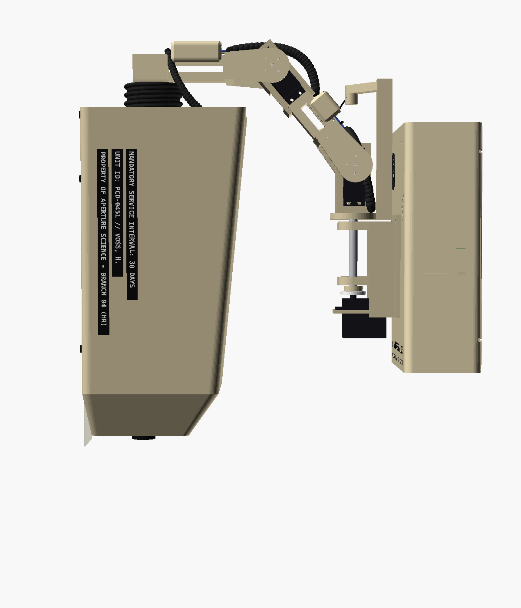 |  |  |
| Raised (balance point) | Audit squint | Stamp (dropped) |
| 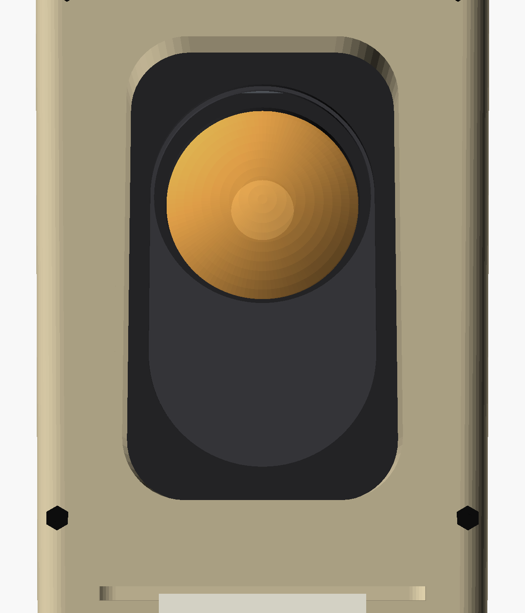 | 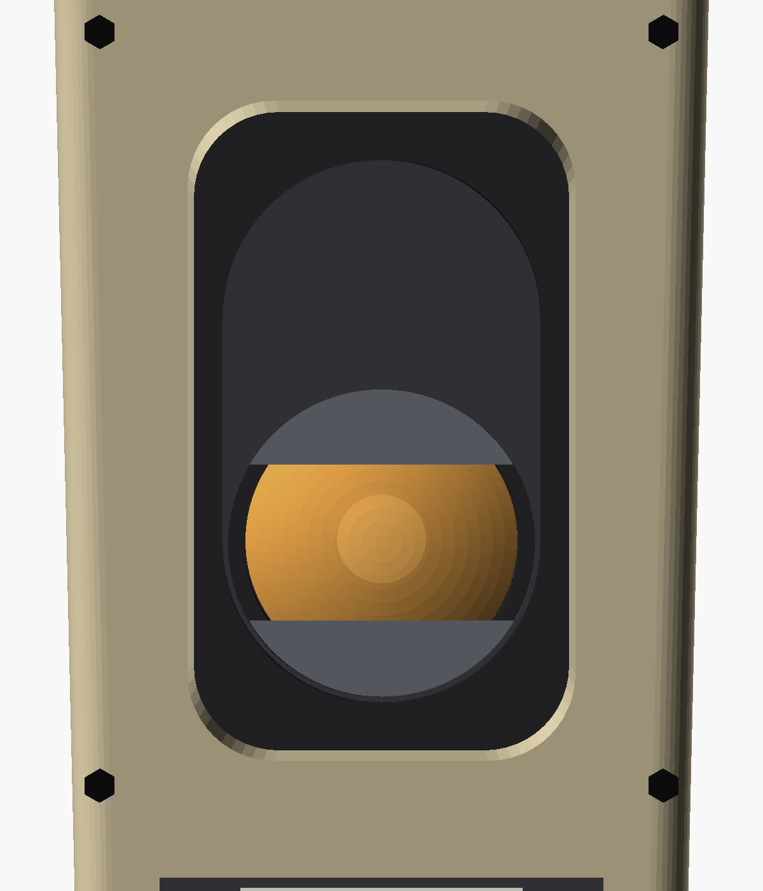 | 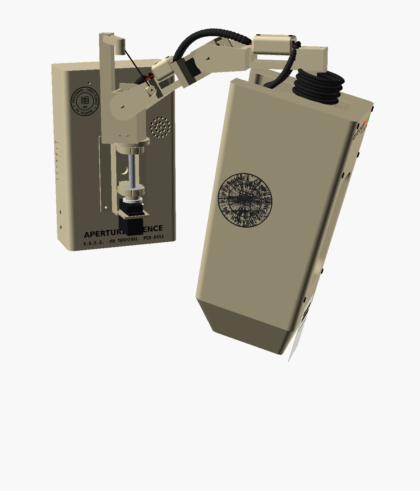 |
| Eye up | Eye down, lids half shut | Sulk (department seal on the left side) |
| 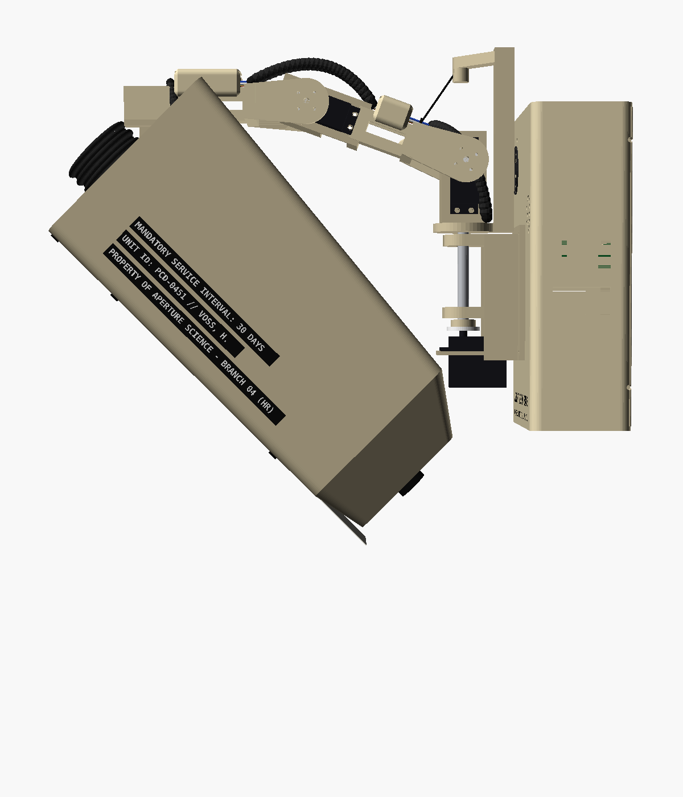 | 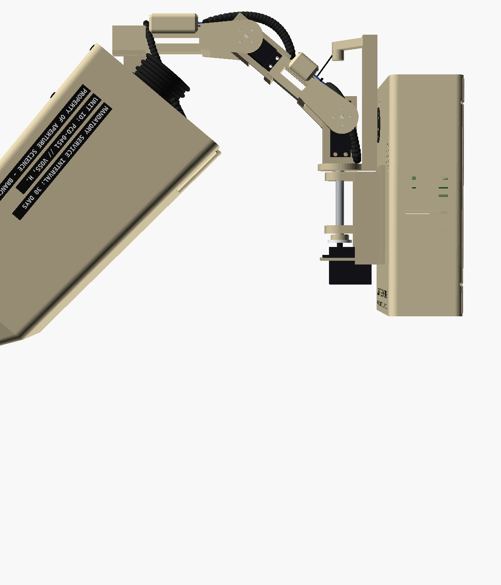 | 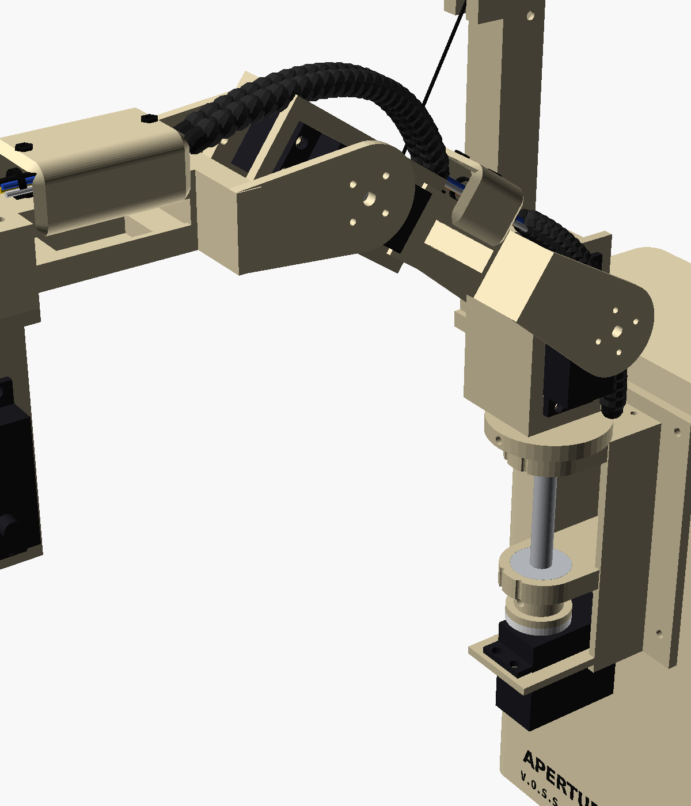 |
| Deep nod (+45°) | Looking up (−40°) | Turret, spring mast, covers, harness |
| 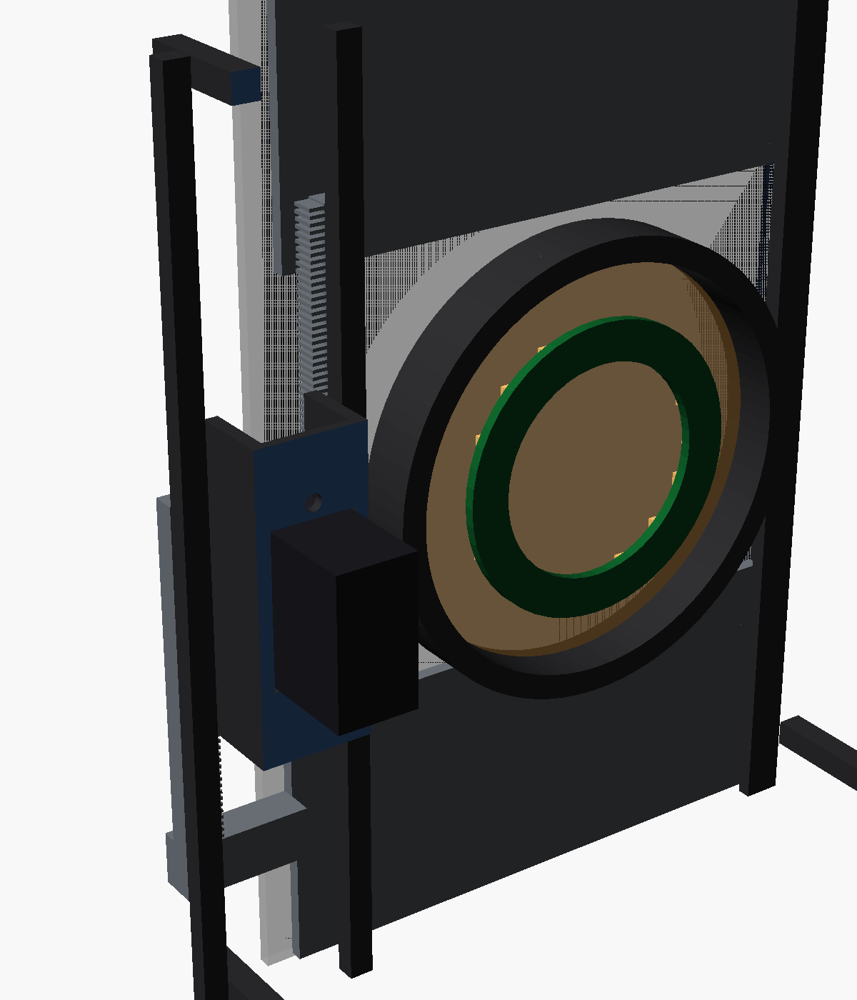 | 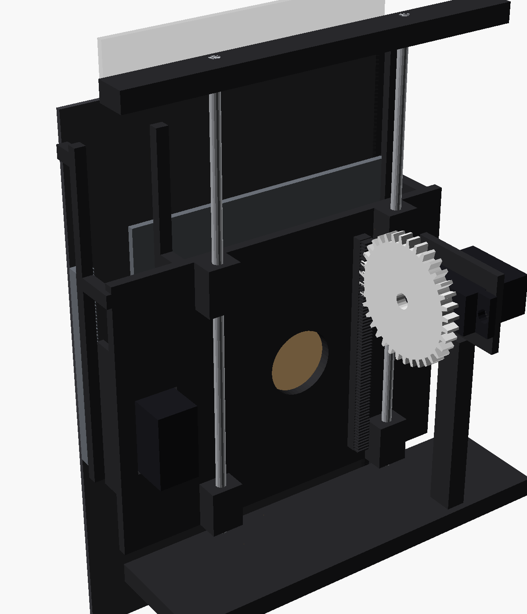 | 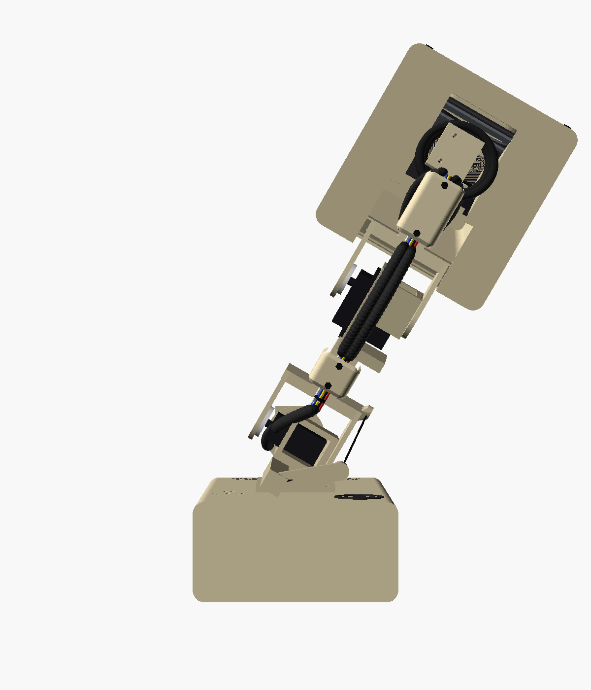 |
| Eye carriage, up and open | Eye carriage, down and closed | Plan, looking at a talker |
